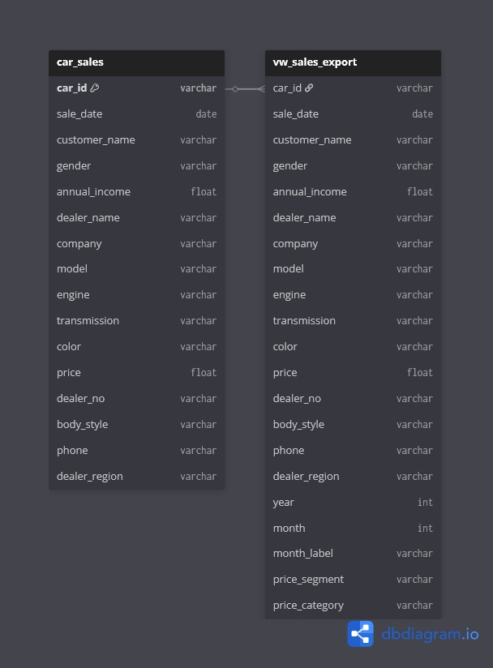
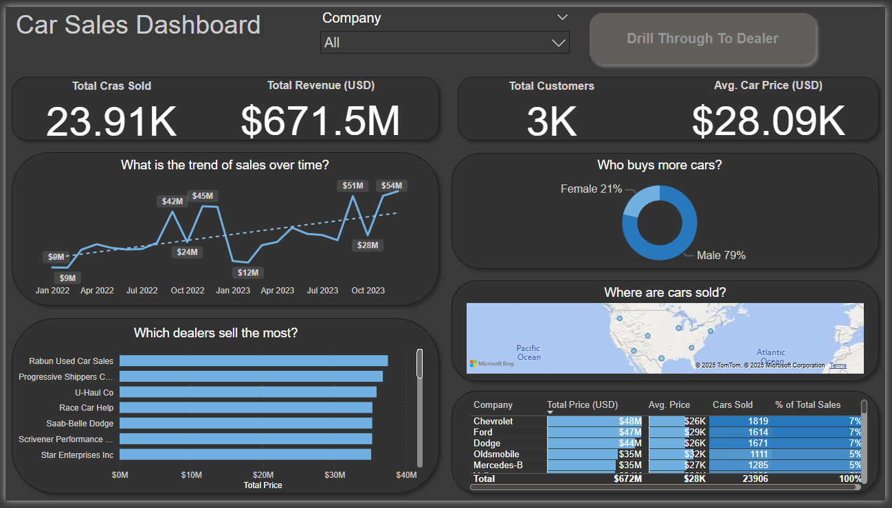
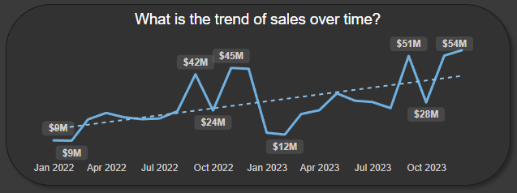
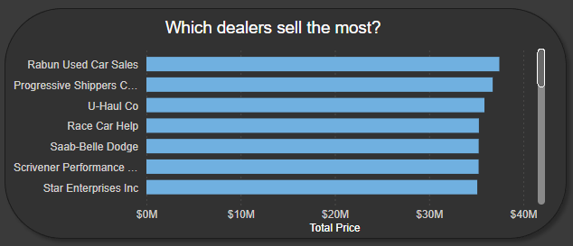
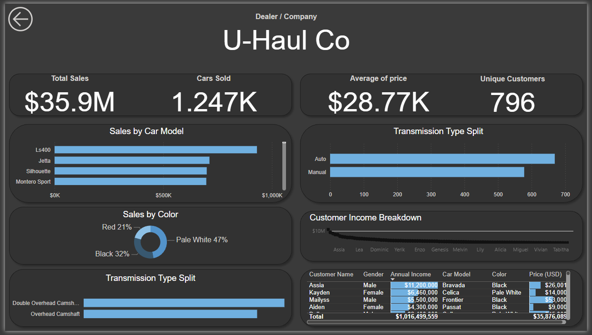
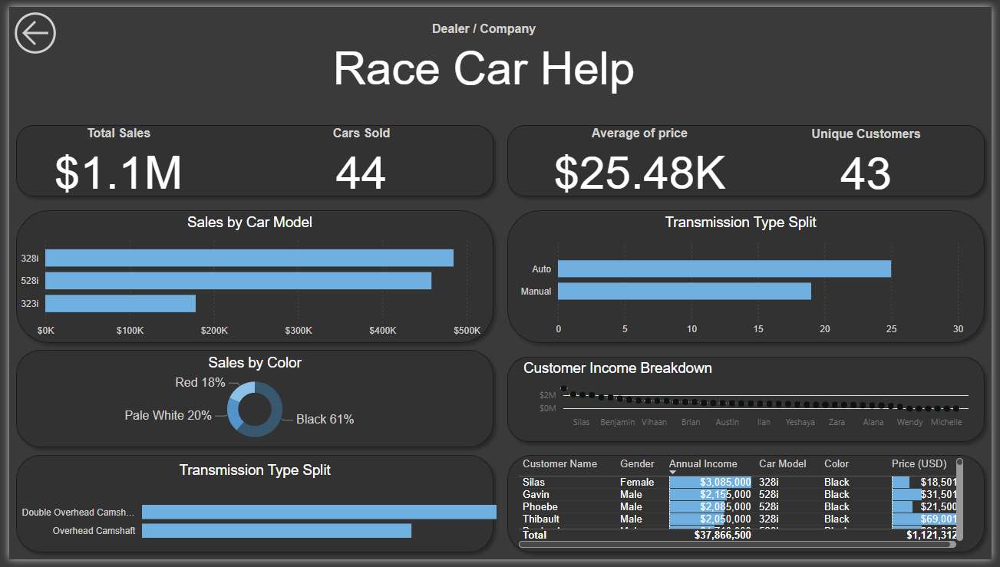

# 🚗 Automotive Car Sales Analytics & ETL

---

## 📘 Project Background

This is a personal data analytics project analyzing automotive sales data to generate actionable insights across **inventory**, **marketing**, and **sales strategy**.

The dataset simulates a multi-brand automotive sales environment with a dual business model:

* **High-volume mid-range sales**
* **High-margin luxury sales**

Key performance indicators (KPIs) tracked include:

* **Total Revenue**
* **Average Car Price (ASV)**
* **Customer Segmentation**

Insights and recommendations are provided across four main areas:

1.  **Sales Trends Analysis:** Revenue, order volume, and average car price (ASV) patterns.
2.  **Dealer & Manufacturer Performance:** Identifying top-performing dealers and analyzing volume vs value.
3.  **Customer Demographics & Behavior:** Understanding how gender and income influence purchases.
4.  **Inventory & Product Preferences:** Popular colors, transmissions, and model trends.

🔗 **SQL ETL Script:**  
**[View ETL & Analytics Script (etl_customers.sql)](https://github.com/aymaneben595/Automotive-Car-Sales-Analytics-ETL-/blob/b95acd9c102d59b0a3d4ecc820e2744f814c451d/Car%20Sales%20Project/VSCode%2C%20SQL%20%26%20Python/SQL/etl_customers.sql)**

🐍 **Python ETL/Analysis Script:**  
**[View ETL & Analytics Script (etl_pipeline.py)](https://github.com/aymaneben595/Automotive-Car-Sales-Analytics-ETL-/blob/91aa422c8a860525c715f1fa89fa657c7a17abad/VSCode%2C%20SQL%20%26%20Python/Python/etl_pipeline.py)**

📊 **Dashboard:**  
**[⬇️ Download Car Sales Dark Mode Dashboard.pbix](https://github.com/aymaneben595/Automotive-Car-Sales-Analytics-ETL-/raw/ff5795cbf8b7f39ac0d61cc357a358097059f840/Power%20Bi/Car%20Sales%20Dark%20Mode%20Dashboard.pbix)**

## 🧩 Data Structure & Initial Checks

After a full **ETL process in PostgreSQL**, the dataset contains **23,910 clean transaction records**.

Two main analytical artifacts were produced:

* **`car_sales`** → Final structured transaction table (one row per sale)
* **`vw_sales_export`** → Analytical view for BI tools (with calculated fields like `year` and `price_segment`)

  

## 📈 Executive Summary

### Overview of Findings

The automotive market generated **$671.5 Million in total revenue**, demonstrating strong performance while highlighting key imbalances:

* **79% of purchases were made by male customers**, revealing a large untapped female segment.
* **Q4 consistently peaks in sales** (October 2023 reached $61M), showing clear seasonality.
* **Average Sales Value (ASV):** **$28.09K**, confirming stable pricing strategies.

  

## 🔍 Insights Deep Dive

### **Category 1: Sales Trends Analysis**

1.  **Total revenue reached $671.5M**, supported by **23.91K cars sold**.
2.  **October 2023 peaked at $61M**, demonstrating strong Q4 momentum.
3.  **ASV remained steady at $28.09K**, validating consistent pricing.
4.  Sales bottomed out in **April 2023 at $12M**, indicating a mid-year dip.

  

### **Category 2: Dealer & Manufacturer Performance**

1. **Haddad Used Car Sales** is the top dealer, followed by **Progressive Shoppers C.** and **U-Haul Co.**  
2. The top three dealers each generate **$30M–$40M**, showing highly concentrated success.  
3. **U-Haul Co.** excels at high-value transactions, with **$35.9M in total sales** and attracting customers with up to **$1.91M annual income**.  
4. **Chevrolet** leads in **total cars sold (10.9K)** but has a lower **Avg. Price ($26K)**, compared to **Mercedes-Benz's $48K Avg. Price**, illustrating the volume–margin trade-off.

  

### **Category 3: Customer Demographics & Behavior**

1. **Male customers** represent 79% of total sales, revealing a significant female market opportunity (21%).  
2. **U-Haul Co.'s top customers** include individuals with high annual incomes, such as **$1.91M** and **$2.01M**.  
3. Sales are highest in the **Pacific and Atlantic regions**, showing successful market concentration in coastal areas.  
4. Dealer **Race Car Help (BMW)** shows **$1.1M from 44 cars**, giving insights into brand-specific performance.

  

### **Category 4: Inventory & Product Preferences**

1. Across the dataset, **Red (21%)** and **Pale White (47%)** dominate, and inventory should prioritize these.  
2. **Automatic transmissions** are strongly preferred, as seen at **U-Haul Co.** (approx. 650 Auto vs. 60 Manual) and **Race Car Help** (approx. 30 Auto vs. 15 Manual).  
3. Top models sold by **U-Haul Co.** are **LS400, Silhouette, and Jetta**.  
4. Dealer **Race Car Help (BMW)** sells mostly **Black (61%)**, followed by **Pale White (20%)** and **Red (18%)**, showing brand-specific trends.

  

## 💡 Recommendations

1. **Target Female Customers:** Launch campaigns for the 21% female segment.  
2. **Replicate Top Dealer Practices:** Train other dealers using **U-Haul Co.’s** high-value acquisition strategies.  
3. **Capitalize on Q4 Momentum:** Focus marketing and staff incentives during **Q4**, which peaked at **$61M in October**.  
4. **Streamline Inventory:** Reduce low-demand manual stock and focus on **popular colors and Automatic transmissions**.  
5. **Address Seasonal Lulls:** Investigate **April 2023 dip ($12M)** and implement targeted incentives.

## ⚙️ Assumptions & Caveats

* **Drill Through Context:** **U-Haul Co.** analysis filtered only by dealer name; **Race Car Help** filtered by **Dealer Name and Company (BMW)**.
* **Data Exclusion:** Less than 1% of records with missing `price` or `sale_date`.
* **Currency:** All prices and income standardized to **USD**.
* **Transmission Classification:** Variants like “Auto” and “Automatic” were unified.

  <i>Created by Aïmane Benkhadda — Personal Data Analytics Project (Excel, SQL, Power BI, Python)</i>
   
  <a href="mailto:aymanebenkhadda5959@gmail.com">aymanebenkhadda5959@gmail.com</a>

